## Introduction

Managing a large number of users or devices in an organization - or even a home lab - introduces several challenges:

- Data security and privacy
- Establishing trust between systems
- Ensuring integrity of data and systems
- Automating access and lifecycle management
- Providing phishing-resistant authentication

## Use Cases for Certificate-Based Authentication

CA (Certificate Authority) can be used for securing many kinds of infrastructure, such as:

- Securing web servers (HTTPS)
- VPN authentication
- Email encryption (S/MIME)
- IoT device identity
- Cloud services and API trust
- Mutual TLS (mTLS) authentication

## Self-Signed vs. Public CAs

When evaluating certificate options, you may consider self-signed certificates or public Certificate Authorities (CAs). However:

### Self-Signed Certificates

- Not trusted by browsers or operating systems by default
- Difficult to distribute and manage in large environments

### Public Certificate Authorities

- Can be expensive for many certificates
- Offer limited control over certificate lifecycle or policy

## The Better Alternative: Build Your Own CA

By building your own Certificate Authority using tools like **Easy-RSA**, you gain:

- Complete control over your PKI
- Zero cost per certificate
- Ability to define your own trust policies and usage

Easy-RSA is a simple yet powerful command-line utility to manage your own Public Key Infrastructure (PKI).

This gives you **total control**, **zero recurring cost**, and the ability to build a trust model that suits your environment.

## Two-Tier CA Hierarchy

A best practice is to create:

- **Root CA**: Offline, used only to sign Intermediate CA
- **Intermediate CA**: Actively issues end-entity certificates

> 🔐 Keep the Root CA offline to minimize security risks.
>
> Only use it when necessary to sign or revoke Intermediate CAs.

```mermaid
graph TD
    RootCA["🛡️ Root CA (Offline) - Signs Intermediate CA"]
    CRLRoot["📄 Root CRL (Exported)"]
    IntermediateCA["🔄 Intermediate CA (Online) - Signs End-Entity Certs"]
    CRLInt["📄 Intermediate CRL"]
    WebServer["🌐 Web Server"]
    EmailCert["📧 Email Client"]
    VPNCert["🔐 VPN Device"]

    RootCA -->|Sign| IntermediateCA
    RootCA -->|Publish| CRLRoot
    IntermediateCA -->|Publish| CRLInt
    IntermediateCA -->|Issue| WebServer
    IntermediateCA -->|Issue| EmailCert
    IntermediateCA -->|Issue| VPNCert
```

## My Real-World Case

Let me share a bit of context. In my home lab, I manage:

- OpenVPN servers
- Microsoft 365 identity integrations
- Internal web applications
- Secure email with S/MIME

Each time I added a new device or user, managing credentials was painful. Building a CA infrastructure simplified trust, reduced manual effort, and enabled automation.

## What’s Next?

In [Part 2](), I’ll walk you through the exact steps I used to build a Root CA, an Intermediate CA, and generate certificates with Easy-RSA.

Stay tuned!
