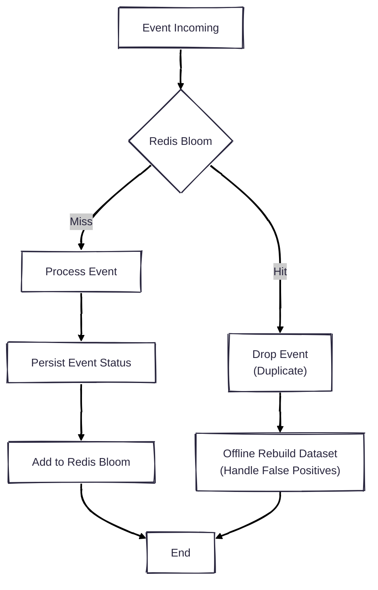

## Problem

Our Customer Experience Platform system which processes tens millions messages a day and we need to prevent sending duplicated messages to end user in recent week.

There are many way to do this, such as:

- Database lookup
- Save and lookup message key in Redis

The first one is a bad idea, with hundreds million sent messages a week, each message must lookup to check if it has been sent or not that takes so much time.
Result in system takes so much time to send messages and put the database to high pressure even though we have indexed them.

The Redis way is quite good if we doesn't have many data. But it will take us much memory. With limited RAM, this solution isn't really the good idea.

In that time, I think that we must have something better.

That is Bloom Filter, just a data structure but can do this job efficiently with just MBs level of memory.

The idea is before send each message, we will check whether this message has been sent. If not, just sent it, then add to Bloom Filter.

The downside is there are some False Positive result.

## What is Bloom Filter

Bloom Filter is space-efficient probabilistic data structure used to check whether an element is a member of a set.

So why we call it probabilistic, because there might be some False Positive results.

Example in my case, system will check if the same message has been sent. If result is false, system can 100% confirm that it's never be sent. Then just sent it without database or Redis needed.

But if result is true, we cannot completely sure that it has been sent. This is mean of False Positive.

Bloom Filter is a fixed size bit array. We call the size is **m**.

    

        
    

    Initialize Bloom Filter with size m=10

We need **k** unique hash function to calculate hash values for each input.

When an element is added to filter, we will hash it with all **k** hash function. Then do the modulo with **m**, the results are indices of bit in array, and we will set them to 1.

E.g. If we want to add "dinhphu28" to filter with size **m**=10 that initialized with all zero and **k**=3 hash functions. We calculate the indices as below:

$$
\begin{aligned}
h1(\texttt{"dinhphu28"}) \bmod 10 &= 3 \\
h2(\texttt{"dinhphu28"}) \bmod 10 &= 2 \\
h3(\texttt{"dinhphu28"}) \bmod 10 &= 8
\end{aligned}
$$

We will set all bits at indices 3, 2, 8 to 1.

Now we have:

    

        
    

    Add "dinhphu28"

Again with "jack":

$$
\begin{aligned}
h1(\texttt{"jack"}) \bmod 10 = 1 \\
h2(\texttt{"jack"}) \bmod 10 = 5 \\
h3(\texttt{"jack"}) \bmod 10 = 8
\end{aligned}
$$

Then we set bits at 1, 5, 8 to 1. The result is:

    

        
    

    Add "jack"

So when we want to check if "dinhphu28" exists in the filter, we calculate indices again, but instead of write to filter, we will check if all these indices are set to 1.
If all bits are set, we can say "dinhphu28" probably exists in filter. If contain any of bit in these indices is 0, we can sure that "dinhphu28" is not exist in filter.

So why I said **probably**, let's do this example:

We want to check if "adam" exists:

$$
\begin{aligned}
h1(\texttt{"adam"}) \bmod 10 = 5 \\
h2(\texttt{"adam"}) \bmod 10 = 1 \\
h3(\texttt{"adam"}) \bmod 10 = 2
\end{aligned}
$$

We can see that, the indices 5, 1, 2 is set, but we has never add "adam" to the filter.

    

        
    

    Check "adam"

Because of these bits have been already set by other elements, we will get the result that "adam" probably exists in filter, but it's not, result in False Positive.

## How I resolve the duplication problem

Each message have a unique key, in my case is combine of message template id and recipient id.
I will add this key to Bloom Filter after sending message.
Before sending each message, I will check if this key exists in filter or not.

If the result is false, I can sure that this message has never been sent, then just send it without database lookup needed.
In case of true, it might be False Positive, but I will just drop it to prevent duplication,
because the cost of sending duplicated message is much higher than the cost of dropping some messages.

For dropped messages, I will push them to Kafka for offline rebuild dataset and handle them later.

With this way, I can prevent tons of duplicated messages with just MBs level of memory used by Bloom Filter.

Some folks might ask, how about multiple instances of service, how to share the Bloom Filter data?

The answer is we can use Redis Bloom, a Redis module that provides Bloom Filter data structure.
With Redis Bloom, we can share the Bloom Filter data across multiple instances of service.

