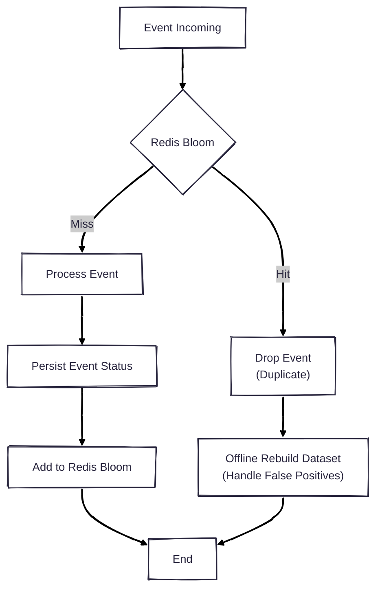

## Problem

Our Customer Experience Platform processes tens of millions of messages per day, and we need to prevent sending duplicate messages to end users within a recent time window.

There are many ways to do this, such as:

- Database lookup
- Saving and looking up message keys in Redis

The first option is a bad idea. With hundreds of millions of messages sent each week, every message would require a lookup to check whether it has already been sent. This takes a lot of time and puts high pressure on the database, even with proper indexing.

The Redis approach is quite good if the dataset is small. However, it consumes a lot of memory. With limited RAM, this solution is not ideal.

At that time, I thought we must have something better.

That is **Bloom Filter** — just a data structure, but it can do this job efficiently with only MB-level memory.

The idea is before sending each message, we check whether it has already been sent. If not, we send it and then add it to the Bloom Filter.

The downside is that there can be false positives.

## What is Bloom Filter

A Bloom Filter is a space-efficient probabilistic data structure used to check whether an element is a member of a set.

Why is it called _probabilistic_? Because there can be false positive results.

In my case, the system checks whether the same message has been sent before. If the result is false, we can be 100% sure that it has never been sent, so we can safely send it without any database or Redis lookup.

However, if the result is true, we cannot be completely sure that it has been sent. This is what we call a false positive.

A Bloom Filter is a fixed-size bit array. We denote its size as **m**.

    

        
    

    Initialize Bloom Filter with size m=10

We need **k** independent hash functions to compute hash values for each input.

When an element is added to the filter, we hash it using all **k** hash functions. Then we take modulo **m** to get indices in the bit array, and set those positions to 1.

For example, suppose we want to add `"dinhphu28"` to a filter with size **m** = 10 (initialized with all zeros) and **k** = 3 hash functions:

$$
\begin{aligned}
h1(\texttt{"dinhphu28"}) \bmod 10 &= 3 \\
h2(\texttt{"dinhphu28"}) \bmod 10 &= 2 \\
h3(\texttt{"dinhphu28"}) \bmod 10 &= 8
\end{aligned}
$$

We set the bits at indices 3, 2, and 8 to 1.

Now we have:

    

        
    

    Add "dinhphu28"

Now, add `"jack"`:

$$
\begin{aligned}
h1(\texttt{"jack"}) \bmod 10 &= 1 \\
h2(\texttt{"jack"}) \bmod 10 &= 5 \\
h3(\texttt{"jack"}) \bmod 10 &= 8
\end{aligned}
$$

We set bits at indices 1, 5, and 8 to 1:

    

        
    

    Add "jack"

To check whether `"dinhphu28"` exists in the filter, we compute the indices again. Instead of writing, we check whether all corresponding bits are set to 1.

- If all bits are 1 → the element _probably_ exists
- If any bit is 0 → the element definitely does not exist

So why do I say **probably**? Let’s look at this example.

Check `"adam"`:

$$
\begin{aligned}
h1(\texttt{"adam"}) \bmod 10 &= 5 \\
h2(\texttt{"adam"}) \bmod 10 &= 1 \\
h3(\texttt{"adam"}) \bmod 10 &= 2
\end{aligned}
$$

All indices (5, 1, 2) are already set, even though we never added `"adam"` to the filter.

    

        
    

    Check "adam"

Because these bits were set by other elements, the filter returns that `"adam"` probably exists — but it does not. This is a false positive.

## How I Resolve the Duplication Problem

Each message has a unique key. In my case, it is a combination of the message template ID and the recipient ID.

After sending a message, I add this key to the Bloom Filter. Before sending a message, I check whether the key exists in the filter.

- If the result is false → I am sure the message has never been sent → send it
- If the result is true → it might be a false positive → I drop it

I choose to drop messages in case of uncertainty because the cost of sending duplicate messages is much higher than the cost of dropping a few valid ones.

For dropped messages, I push them to Kafka for offline processing to rebuild the dataset and handle them later.

With this approach, I can prevent tons of duplicate messages while using only MBs of memory for the Bloom Filter.

Some people might ask: what about multiple service instances? How do we share the Bloom Filter?

The answer is **Redis Bloom**, a Redis module that provides Bloom Filter data structures.

With Redis Bloom, we can share the filter across multiple service instances.

