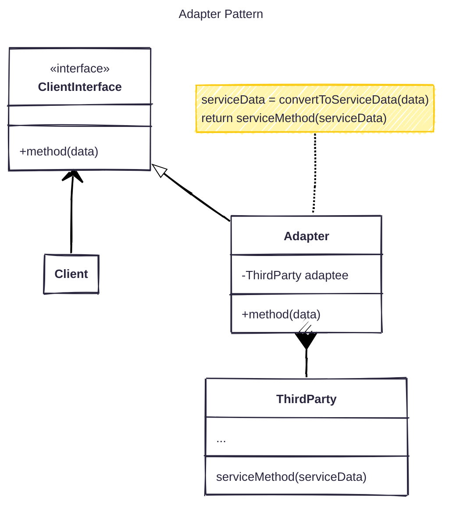
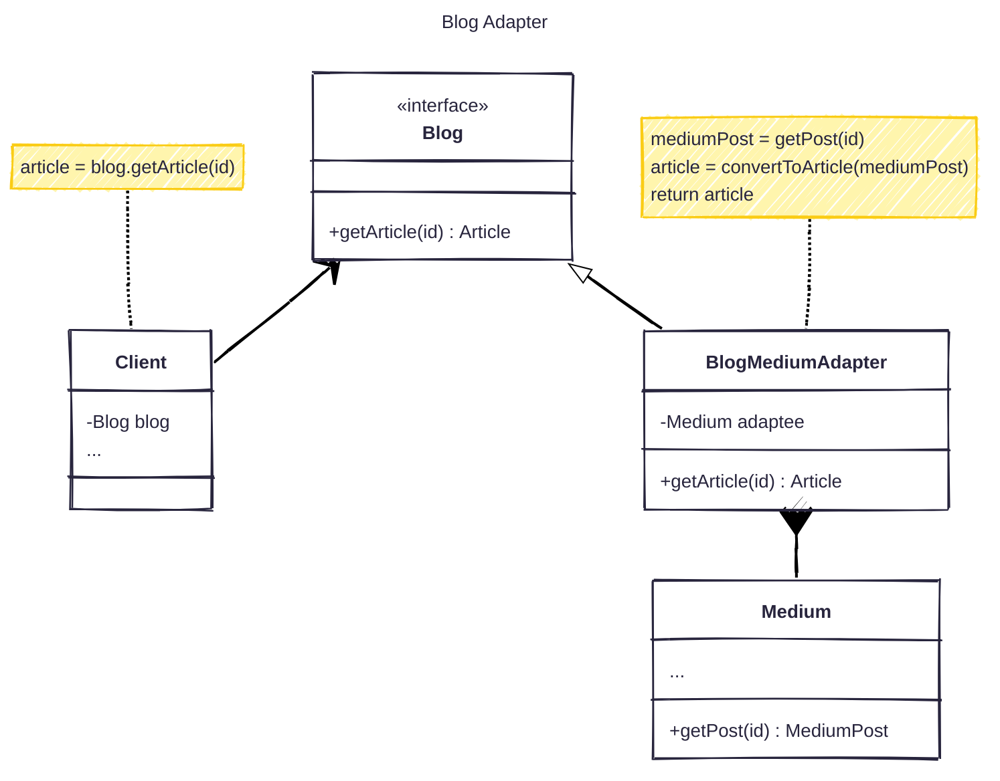

## Problem

In development routines, we usually work with so many incompatible interfaces such as 3rd-party APIs, libraries, legacy code.

Some folks write code with tangled business logic with 3rd-party APIs. E.g: Use the same model for both business and payload.
Lead to they need the APIs must me completed and ready to use.

But what happened if:

- Our code and these APIs are written simultaneously
- One of them need to change in future

Right!
The first one, we must wait to the APIs completed and the overall task duration will stretch out.

Instead of do nothing and make hasty when the deadline arrives. Just do as below:

Because when we code our business, we have known what we need, like inputs, outputs.
We can write interfaces, then the all business beyond them, test independently, write mockup implementation if needed.
Don't need to wait until the APIs completed.

Then when the APIs is on our hand, just do:

- **Learning Test**: To know and verify that all feature we need has worked properly.
- **Write Connector**: Write the connector which match exactly only the APIs. (Remember to delete the mockup)
- **Write Adapter**: So now connect the interface with connector with just the adapter.

The second, the change. If we let it happened, we have violated the Open/Closed Principle.
Mean when we need to change anything, we must change all of relative code. It's a huge impact, and takes us so much time to change.

With Adapter Pattern, we just need to change only one side and make the adapter compatible.

## What is Adapter Pattern

I think with above problem and the name, you have known what is the Adapter Pattern.

Think it like a plug adapter, in Vietnam we usually use Type-A charger for my laptop.
But when I travel to other countries using other types, such as Type-I, I don't want to buy another one to just use in few days then throw it away. I just need to buy a I-A plug adapter or even universal plug adapter to use anywhere with just some dollars.



### Example



```java
public interface Blog {
    Article getArticle(String id);
}

public class Medium {
    public MediumPost getPost(String id) {
        MediumPost post = getPostFromMediumApi(id);
        return post;
    }

    private getPostFromMediumApi(String id) {
        // ...
    }
}

public class BlogMediumAdapter implements Blog {
    private Medium medium;

    public BlogMediumAdapter(Medium medium) {
        this.medium = medium;
    }

    @Override
    public Article getArticle(String id) {
        MediumPost mediumPost = medium.getPost(id);
        Article article = convertToArticle(mediumPost);
        return article;
    }

    private Article convertToArticle(MediumPost post) {
        // ...
    }
}

public class Client {
    private Blog blog;
    public Client(Blog blog) {
        this.blog = blog;
    }

    public void exampleClientMethod() {
        String exampleId = "abc1234";
        Article article = blog.getArticle(exampleId);
        // Do anything you want with article, e.g. print article's properties
    }
}

public class Main {
    public static void main(String[] args) {
        Medium medium = new Medium();
        Blog blog = new BlogMediumAdapter(medium);
        Client client = new Client(blog);

        client.exampleClientMethod();
    }
}
```

## Pros and Cons

Pros:

- Separating the business logic and interfaces, satisfy the Single Responsibility Principle.
- Just need to write a new adapter instead of changing the existing interfaces or business logic, satisfy the Open/Closed Principle.

Cons: Because of adding multiple interfaces and adapter, the code will be more complex. Sometime we just need to change a little bit in the business layer.
