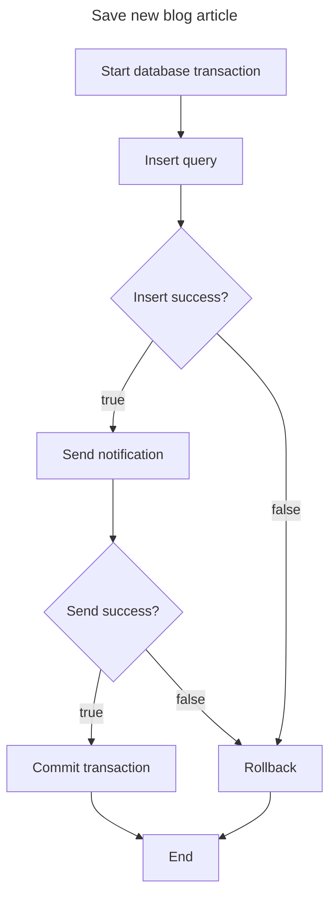

When we work with with function requires atomic but not just only database works.

E.g. Saving new blog article with 2 step:

- Insert to Database
- Send notification

What happened when send notification failed? We have record saved in database without notification.

Client code receives error but database insert still effects.

The solution is treat both of 2 step as transaction like this:

Despite data integrity, in this approach, the database must keep the connection during process. If **Send notification** takes so much time, this connection will be locked until send completely. Lead to multiple processes like this will consume almost database connection and make huge impact on performance, scalability.

It's just an example about the transactional problem. Reality, we can accept the notification failure as long as the database insert successfully. Because in the blog use-case, the notification is not too important to strict like this.

In some system which traffic is not high, monolith, most of critical feature is work on the same database, this is the easiest way to resolve the problem.

For microservices or high-scale systems, we must try to break the rule that everything must be in one transaction. And we can use Outbox pattern or Saga instead.

No approach is the best solution, choose the most suitable for your use case and accept the trade-off.
