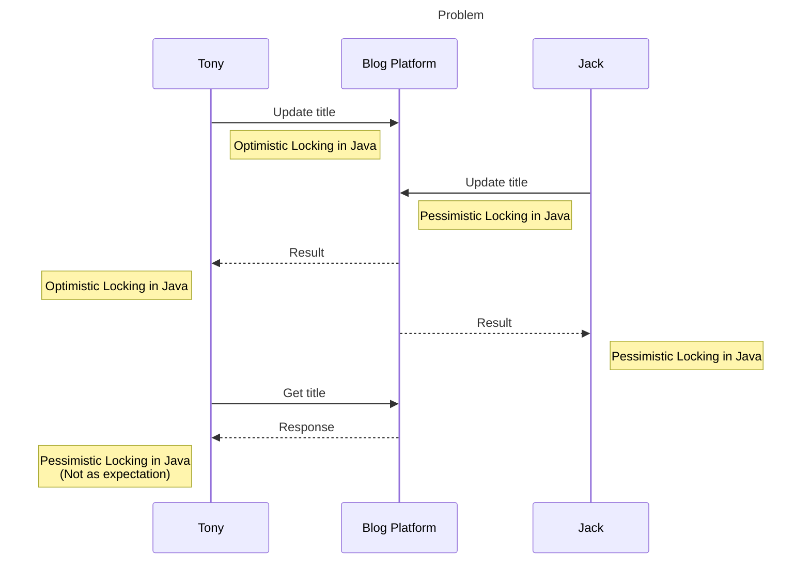
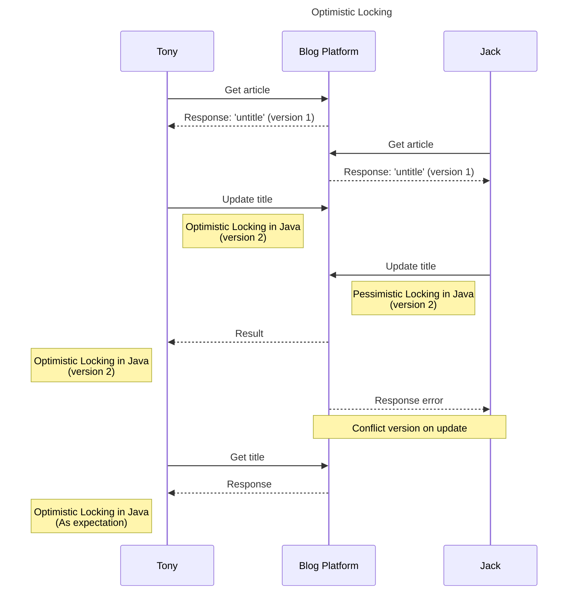
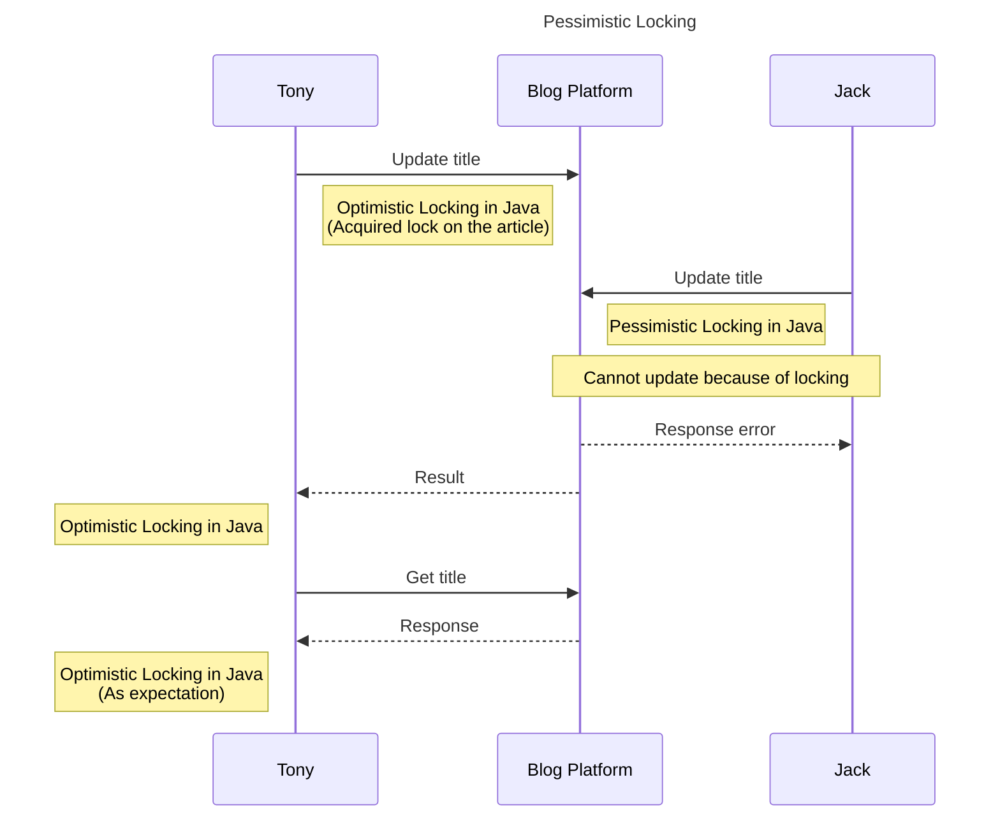

## Problem

In software development, we can't avoid the resource contention problem.

Tony and Jack are two users of a blogging platform.
One day, dinhphu28 tells Tony to change the 'untitled' post to 'Optimistic Locking in Java' because the mistake when creating the post.
Everything must be done before 7PM because the post will be published at that time.

Tony start editing the title at 5:00 PM and save it at 5:01 PM. Fur sure, he has reloaded the page and see the title is changed as he wanted.
But Jack, who is the editor of the post, also see the title is 'untitled' and starts editing it at the same time.
Jack changes the title to 'Pessimistic Locking in Java' and saves it at 5:30 PM because he is busy to bathe his cat and forget to save it.

When Tony click the save button, he believes that his change is correct and should be saved. Then he prepares to the date with his girlfriend.

At 7 PM, While dating with his girlfriend, Tony receives a message from dinhphu28 that why the title is changed to 'Pessimistic Locking in Java' instead of 'Optimistic Locking in Java' as he requested.

"What's the f\*\*k is going on? I just save it at 5:01 PM. Why the title is changed to 'Pessimistic Locking in Java'?" Tony asks.

## How to solve the problem?

The idea is to use locking mechanism to prevent the resource contention problem.
In this case, we have two approach:

- Optimistic Locking: Tony and Jack can edit the post at the same time, but when they save it, the system will check if the post is changed by another user.
  If it is changed, the system will reject the change and ask the user to reload the page and edit again.

- Pessimistic Locking: When Tony starts editing the post, the system will lock the post and prevent Jack from editing it until Tony saves it or cancel the edit.

## Pros and Cons

### Optimistic Locking

- Pros:
  - Better performance because it allows concurrent editing.
  - Suitable for scenarios where conflicts are rare.
- Cons:
  - Can lead to data loss if multiple users edit the same resource simultaneously.
  - Users may have to redo their work if their changes are rejected.

### Pessimistic Locking

- Pros:
  - Prevents data loss by ensuring that only one user can edit the resource at a time.
  - Suitable for scenarios where conflicts are common.
- Cons:
  - Can lead to performance issues due to locking, especially if users hold locks for a long time.
  - Can cause deadlocks if not implemented carefully.

## Conclusion

Of course, the update process just takes a fraction of second, not long as the example above.
But the problem is still the same, when multiple users edit the same resource at the same time.
Choose the right locking mechanism based on the specific use case and requirements of your application is crucial to ensure data integrity and performance.
