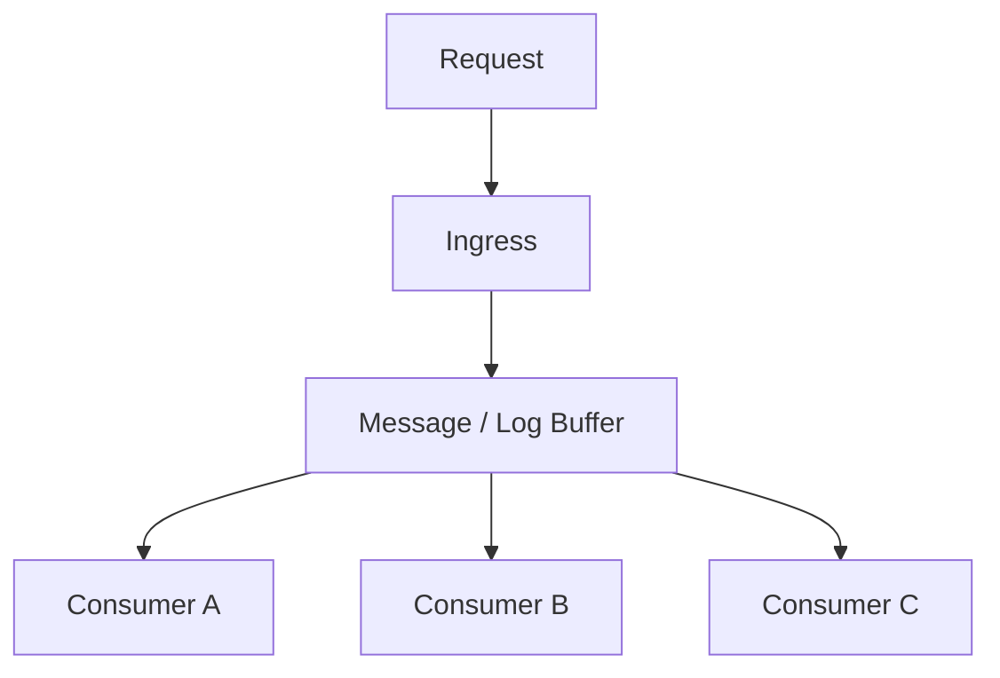
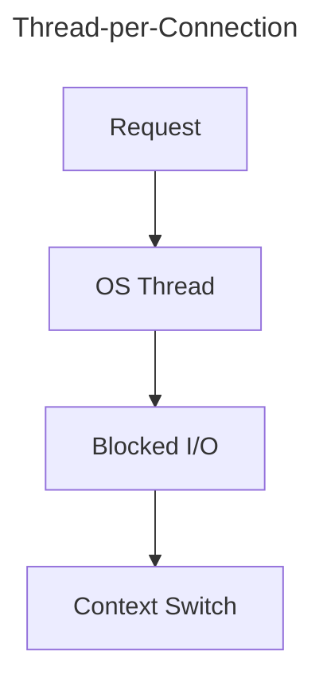
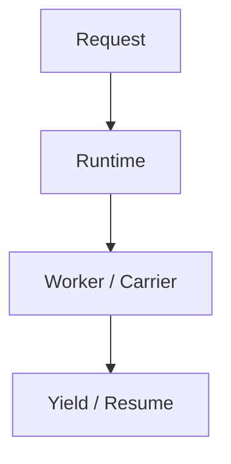
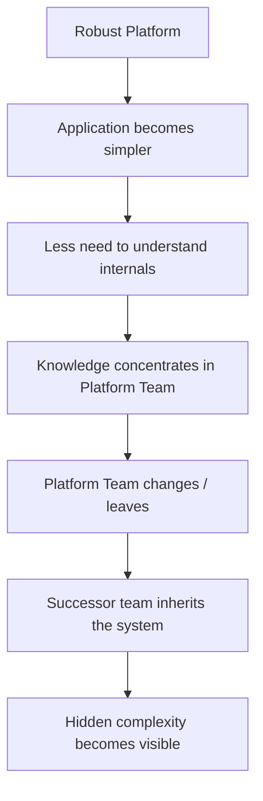
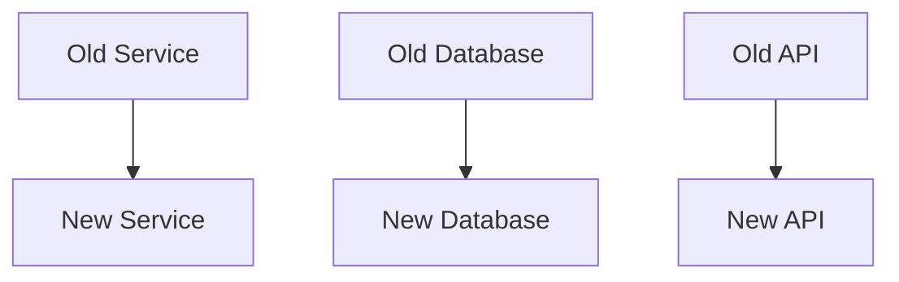
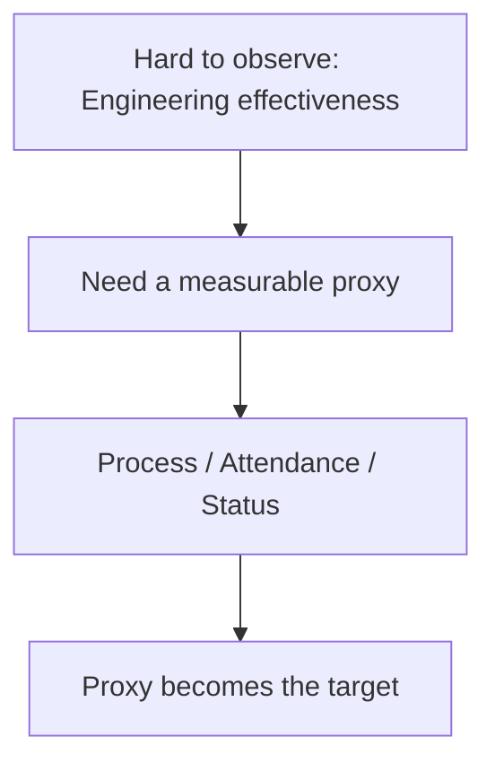
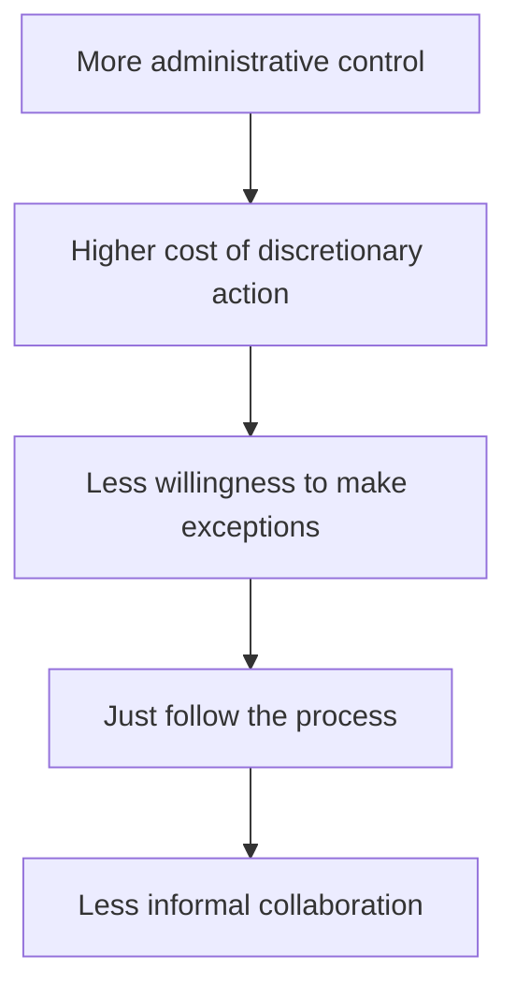
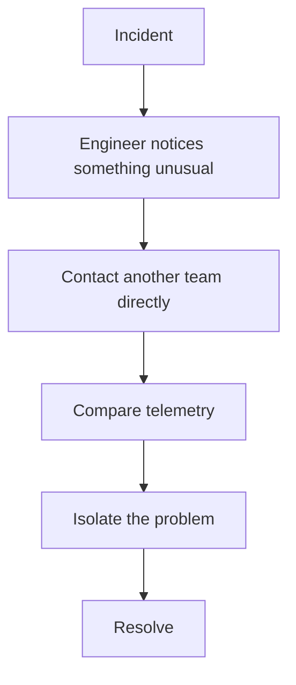
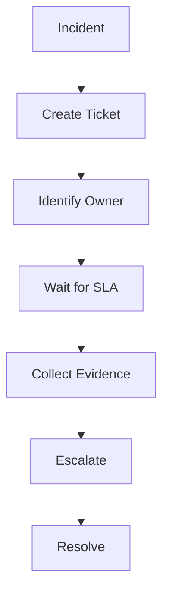
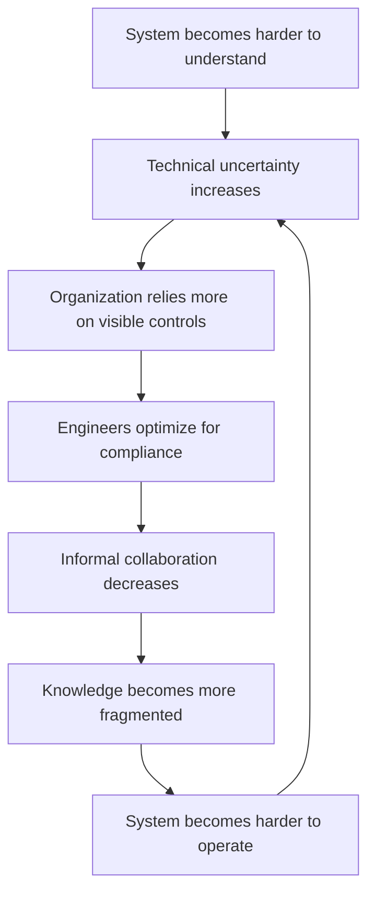

## Introduction

When a software system has been built and operated for many years, we often think of its decay as a technical problem:

- The code becomes harder to maintain
- Dependencies grow
- Performance declines
- The architecture no longer fits the scale of the system

But there is a more interesting question:

What happens when the system changes but the knowledge and organizational structure which once helped it work well do not change with it?

I think many of you know the **Conway's Law**, and it gives me an interesting perspective on this:

> Organizations which design systems are constrained to produce designs which are copies of the communication structures of these organizations.

From this perspective, we can see that software architecture is not only the result of technical decisions. It also reflects how people communicate, collaborate and divide responsibilities.

Do you realize that this relationship can also work in reverse?

When architecture changes, teams change, or system boundaries are reorganized, the communication structure around the system can change with them. When these changes happen together, once the system works well, it can gradually lose some of the characteristics that made it work well in the first place.

This article isn't an attempt to identify a particular "villain". Instead, I want to look at the phenomenon as a **_socio-technical feedback loop_**: how technical systems, people and organizational structures influence each other over time.

## When The System Looks Healthy

One of the easiest things to misread in distributed systems is low resource utilization.

Low utilization doesn't necessarily mean that the system is unhealthy.

E.g. An event-processing system designed around asynchronous processing may decouple ingestion from persistence through a message broker or log buffer.

When a request arrives, the system does not necessarily have to complete all process immediately. It can ack the event, put into a queue, and let workers handle the remaining work.

That creates a structure like this:

CPU utilization at the ingress layer may remain relatively low because the system is not spending most of time performing expensive computation.

Similarly, in a non-blocking model or a runtime that manages concurrency efficiently, a large number of connections does not necessarily imply a large number of OS threads.

At a simplified level:

While another concurrency model may look like this:

The important point is not that one model is always better than the other, but:
Two systems handling the same number of requests can have very different resource consumption patterns across CPU, Mem, threads and IO.

That means a single metric such as CPU or Mem utilization can easily lead to the wrong conclusion about the actual health of a system.

System using 30% CPU is not necessarily under-provisioned, and a system using 90% CPU does not necessarily need more CPU.

Instead, the bottleneck may be elsewhere, such as database contention, network latency, locking, disk IO, queueing or the way concurrency is organized inside the application itself.

This is where migration becomes interesting.

If a successor system changes its execution model while continuing to be evaluated using the old metrics, it may begin to exhibit latency or resource pressure that didn't exist before.

E.g. Moving from a async architecture to a synchronous.

Some folk may think "Maybe we need more resources."

But if the real bottleneck is the execution model or IO pattern, scaling up may solve only a small part of the problem.

This is just a simple example of the gap between resource utilization and system behavior.

## When Abstraction Starts Hiding Knowledge

Abstraction is one of the most important concepts in software engineering.

- An application does not need to understand how the kernel processes sockets in order to use an HTTP client.
- A developer using database abstraction does not need to understand every page of a B-Tree indexes.

That is the point of abstraction, but it has a downside. When an abstraction works very well for a long time, its users (developers) may have less and less reason to understand what happens underneath.

This is not a bad thing in itself. In fact, it's often the goal of abstraction to allow developers to focus on higher-level concerns. Yeah, I think we all know the **separation of concerns** principle.

But the problem arises when the knowledge about the abstraction and its underlying implementation becomes concentrated in a very small group of people.

E.g. A platform team may build a runtime or framework that provides:

- Centralized error handling
- Connection management
- Thread management
- Retry mechanisms
- Observability
- Auth

The application team can work through a relatively simple API/Interface without needing to understand what happens underneath.

Initially, everything works well, the feedback loop may look like this:

This creates a paradox: the more successful the abstraction becomes, the less users need to understand the implementation behind it.

But what happens when the implementation changes or the team that maintaining it are no longer there?

Right! The knowledge that hidden by the abstraction can become a significant gap.

This is one form of **cognitive offloading**.

People don't need to keep entire complexity in their heads because of the carry of behind systems. But when the system changes, some of that cognitive load can return quickly.

## Migration Is Not Just Code Migration

When people talk about system migration, they usually focus on what is visible:

But do you know what is harder to see?

That's context!

Context includes knowledge such as:

- Why a component was designed in a particular way
- Why system use Postgres instead of MySQL
- Why a retry policy cannot simply be increased
- Where to look first when something goes wrong

This information does not exist in the source code. Some of it may be in documentation, some in the monitoring system, and some may only exist in the heads of the people built or operated the system.

So a system migration can involve at least three things:

- Code
- Knowledge
- Communication structure

If only the code is migrated, while the other two are not, the successor team may receive a system that is technically correct but lacks the context required to operate it effectively.

Yeah, this is where the Conway's Law becomes interesting.

If the original system was built around a particular team structure, its architecture will reflect that structure.

When the organization changes, the communication structure changes as well.

As the successor team takes ownership, it may naturally reshape the system around the way it communicates and divides responsibilities.

Sure, that's not really a bad thing. But if the new communication structure does not align with the technical boundaries of the system, architectural decay can gradually appear.

## When Technical Uncertainty Leads to Behavioral Control

There is another pattern worth considering.

When an organization can't directly observe or evaluate a complex system, it may rely more heavily on things that are easy to observe and easy to measure.

In engineering, we can measure:

- Latency
- Throughput
- Error rate
- Deployment frequency
- Recovery time
- Resource utilization

But these metrics can sometimes be difficult to interpret. E.g:

> CPU is only at 30%, why are request still slow?

> The team deploys frequently, but why are incidents still increasing?

> The server still has plenty of memory, why does the service still run OOM?

These questions require technical context. When that context is missing, the organization may turn toward metrics that are easier to see:

- Attendance
- Number of meetings
- Ticket counts
- Response times
- Process compliance
- Physical presence

These metrics are not really meaningless. The problem begins when they become proxies for things the org actually wants to control but cannot directly observe.

E.g:

This is related to the broader idea behind Goodhart's Law:

> When a measure becomes a target, it ceases to be a good measure.

A metric that was originally intended to support dicision-making can gradually become a target that people optimize directly. At that point, achieving the metric and achieving the underlying objective may start to diverge.

## From Control to Compliance

As process becomes increasingly important for reducing uncertainty, people naturally begin to optimize their behavior around that process.

This can happen gradually.

At first:

> Let's follow the process so that everyone can coordinate better.

Then:

> This process must be followed.

And eventually:

> If that is what the process says, then that is exactly what I will do.

This is the concept of **malicious compliance**.

Malicious compliance does not necessarily begin with an intention to cause harm. In some environments, it may simply emerge as a way of minimizing personal risk:

An engineer may previously have helped another team debug a production problem because they knew the incident could affect the wider system.

But if activities outside one's formal scope can create additional responsibility or administrative risk, the safer choice may become:

> That is outside my scope.

At the individual level, this may be a perfectly reasonable decision.

But at the system level, it can create a different problem.

## When the Shortcuts Disappear

Distributed systems do not depend only on APIs and protocols. They also depend on communication paths between people.

In a high-trust environment, an incident might be handled like this:

A ticket is not always required. A meeting is not always required. Exact ownership does not always need to be established before debugging starts.

In an environment where every communication path must go through a formal process, the flow may become:

Formal processes still have value. Especially in large organizations, they can reduce ambiguity and establish accountability. But process and collaboration are not substitutes for one another.

A system may need both:

- Process to provide consistency
- Trust to handle situations that the process did not anticipate

When the 2nd component disappears completely, an organization may become very good at following procedures while becoming slower at handling problems that fall outside those procedures.

## The Feedback Loop of Systemic Decay

Putting the previous sections together, we can sketch a broader feedback loop:

- None of the steps in this loop necessarily has to come from a "bad" decision.
- A platform team builds an abstraction to help application developers move faster.
- A manager introduces a process to increase accountability.
- An engineer follows that process to reduce personal risk.
- A team requires tickets so that work does not get lost.
- All of these can be reasonable decisions when viewed locally.

But when these decisions interact over a long enough period of time, the global behavior of the organization can become very different from the original intention behind each individual decision.

That's perhaps the most interesting part of socio-technical systems.

A large system does not necessarily become fragile because of one bad decision. It can become fragile because many locally reasonable decisions combine into a feedback loop that is unhealthy at the global level.

## Conclusion

Architectural decay is often treated as a source code problem. But in sufficiently large systems, source code is only one part of the system. Architecture also depends on:

- How teams communicate
- Where knowledge is concentrated
- How abstractions are built and maintained
- How the organization measures effectiveness
- How people respond to the control mechanisms around them

A system can be technically well designed and still gradually lose its operational resilience when context disappears.

An organization can introduce processes that are individually reasonable yet unintentionally reduce informal collaboration.

And an engineer may simply do exactly what is requested while the resulting behavior causes the system to lose some of its resilience.

That is why I find Conway's Law more interesting than a simple statement about architecture.

It reminds us that software architecture and organizational architecture do not exist independently. When one changes, the other can change with it.

And sometimes, something that starts as a relatively small technical issue (an abstraction, a migration, a process, a boundary) can eventually create much larger organizational effects.

Perhaps that is why, when evaluating a system migration, we should not ask only:

> Can the new system handle the workload?

But we should also ask:

> Does the organization still have the knowledge and communication structure required to operate it?
